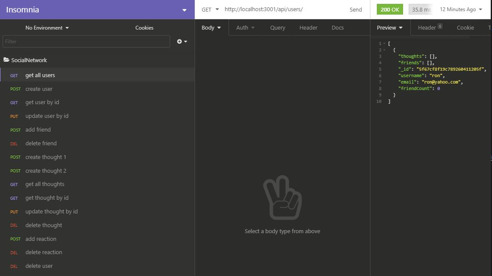

# SocialNetwork

This project is to build an API for a social network web application where users can share their thoughts, react to friends’ thoughts, and create a friend list. 

# Technologies used

* Node.js
* Express.js
* MongoDB, 
* Mongoose
* Insomnia

# Functionality of the application - Video

https://drive.google.com/file/d/1jyE-Tw-wbHO1ICRxzVWE79OH3ZXNg10u/view?usp=sharing

# GitHub repository

You can find the repository here: https://github.com/evkonradi/SocialNetwork

# Page preview

This is the preview of the initial page:

